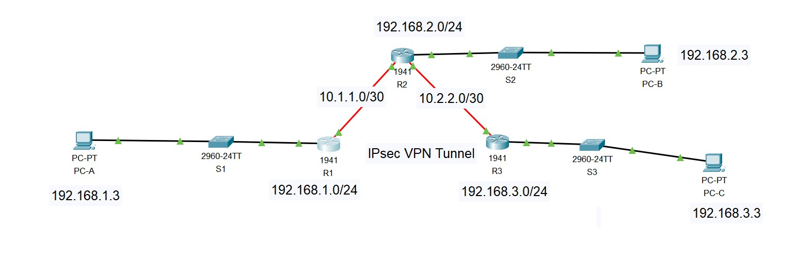

# **Site-to-Site IPsec VPN Lab**

## 💑 **Table of Contents**
- [Description](#description)
- [Tools and Technologies Used](#tools-and-technologies-used)
- [Environment](#environment)
- [Initial Topology](#initial-topology)
- [Task Instructions](#task-instructions)
- [My Configuration Steps](#my-configuration-steps)
  - [Part 1 - Configure IPsec Parameters on R1](#part-1---configure-ipsec-parameters-on-r1)
  - [Part 2 - Configure IPsec Parameters on R3](#part-2---configure-ipsec-parameters-on-r3)
  - [Part 3 - Verify the IPsec VPN](#part-3---verify-the-ipsec-vpn)
- [Verification Screenshots](#verification-screenshots)
- [Conclusion](#conclusion)

---

## **Description**
This lab focuses on designing and implementing a **Site-to-Site IPsec VPN** using Cisco Packet Tracer. The objective is to securely connect two remote branch networks (**192.168.1.0/24** and **192.168.3.0/24**) across an untrusted WAN, with traffic traversing an intermediate router (**R2**) that is unaware of the VPN.  

The project demonstrates the complete lifecycle of an IPsec tunnel:  
- **Identifying interesting traffic** with ACLs  
- **Phase 1 (ISAKMP/IKE)** negotiation for authentication and key exchange  
- **Phase 2 (IPsec/ESP)** for encrypting and authenticating packets  
- Applying **crypto maps** to WAN interfaces to enforce encryption  

By the end of the lab, only traffic between the two LANs is encrypted, while other traffic remains in cleartext. This validates the selective protection IPsec offers. The exercise also reinforces real-world skills in configuring VPNs, securing site-to-site communication, and verifying encryption using Cisco CLI tools.

---

## **Tools and Technologies Used**
- **Cisco Packet Tracer**
- **Cisco CLI (Command Line Interface)**
- **IPsec VPN (ISAKMP + ESP)**
- **Access Control Lists (ACL)**
- **Routing with OSPF 101**

---

## **Environment**
- **Operating System**: Windows 11  
- **Simulator**: Cisco Packet Tracer 8.x  

---

## **Initial Topology**

- 
---

## **Task Instructions**

1. Verify connectivity across the network.  
2. Configure **R1** and **R3** for a Site-to-Site IPsec VPN with the following parameters:  
   - **Encryption**: AES 256  
   - **Authentication**: Pre-shared key (`vpnpa55`)  
   - **Hashing**: SHA-1  
   - **DH Group**: 5  
   - **IKE Lifetime**: 86400 seconds  
   - **Transform Set**: `VPN-SET` (esp-aes, esp-sha-hmac)  
   - **Crypto Map**: `VPN-MAP`  
   - **Interesting traffic ACL**:  
     - R1 → `192.168.1.0/24 → 192.168.3.0/24`  
     - R3 → `192.168.3.0/24 → 192.168.1.0/24`  
3. Apply crypto maps to the respective serial interfaces.  
4. Verify VPN establishment with pings and `show crypto` commands.

---

## **My Configuration Steps**

### **Part 1 - Configure IPsec Parameters on R1**
- Create ACL 110 for interesting traffic.  
- Configure ISAKMP policy with AES 256, SHA-1, DH group 5, and pre-shared key.  
- Configure transform-set `VPN-SET`.  
- Configure crypto map `VPN-MAP` and apply it to `S0/0/0`.

### **Part 2 - Configure IPsec Parameters on R3**
- Mirror R1’s configuration with ACL 110 for reverse traffic.  
- Configure ISAKMP policy with the same parameters.  
- Configure transform-set `VPN-SET`.  
- Configure crypto map `VPN-MAP` and apply it to `S0/0/1`.

### **Part 3 - Verify the IPsec VPN**
- Before interesting traffic: `show crypto ipsec sa` shows 0 packets encrypted/decrypted.  
- After pings from PC-A (192.168.1.3) → PC-C (192.168.3.3), the counters increase.  
- Pings from PC-A → PC-B (192.168.2.3) are unencrypted (uninteresting traffic).  

---

## **Verification Screenshots**

### **1. Initial Crypto Map Configuration**
- 

---

### **2. Ping from PC-C (Fail, No VPN yet)**
- 

---

### **3. IPsec SA After Interesting Traffic**
- 

---

### **4. Successful Uninteresting traffic Ping (PC-B → PC-A)**  
- 

---

### **5. IPsec SA After Uninteresting Traffic (No change to the results which verifies that uninteresting traffic is not encrypted)**  
- 

---
## ✅ **Conclusion**
This lab successfully demonstrates:  
- Site-to-Site IPsec VPN setup between R1 and R3.  
- Use of ISAKMP for Phase 1 negotiation and IPsec ESP for Phase 2.  
- Verification of encrypted vs. unencrypted traffic.  
- Secure communication between remote LANs through an untrusted WAN.  
